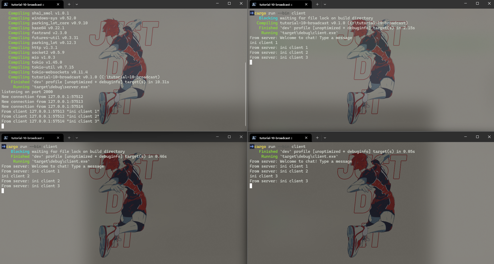

## Joe Mathew Rusli
## 2306152310 / Adpro A

### Experiment 2.1


Cara Menjalankan:

1.  **Menjalankan Server:**
    ```bash
    cargo run --bin server
    ```
    Server akan dimulai dan menunggu koneksi dari klien.

2.  **Menjalankan Klien:**
    Buka tiga terminal atau command prompt baru. Untuk setiap terminal, run perintah berikut:
    ```bash
    cargo run --bin client
    ```
    Setiap perintah akan menjalankan satu instance klien yang akan mencoba terhubung ke server.

**Apa yang Terjadi:**

Setelah server berjalan dan ketiga klien terhubung, jika kita mengetikkan sebuah pesan di salah satu jendela klien dan menekan Enter, pesan tersebut akan dikirim ke server. Server kemudian akan meneruskan pesan ini ke semua klien lain yang sedang terhubung. Hasilnya, pesan yang kita ketik di satu klien akan muncul di jendela terminal semua klien lainnya, termasuk klien pengirim. Ini mendemonstrasikan fungsionalitas broadcast dari server.

### Experiment 2.2

Aplikasi berubah menjadi menggunakan port `8080` untuk komunikasi antara server dan klien. Pengaturan port ini dapat ditemukan di kedua file berikut:

- Server: `src/bin/server.rs` pada baris `let listener = TcpListener::bind("127.0.0.1:8080").await?;`
- Klien: `src/bin/client.rs` pada baris `ClientBuilder::from_uri(Uri::from_static("ws://127.0.0.1:8080"))`

Protokol yang digunakan untuk komunikasi adalah WebSocket. Hal ini terlihat dari penggunaan library `tokio-websockets` di kedua sisi aplikasi. Di sisi server, koneksi WebSocket diterima menggunakan `ServerBuilder`, sedangkan di sisi klien, koneksi dibuat menggunakan `ClientBuilder`.

Karena konfigurasi port awalnya `2000`, perubahan kode yang diperlukan untuk menjalankan aplikasi pada port ini tinggal mengganti seperti line diatas, yang awalnya 2000 menjadi 8080.